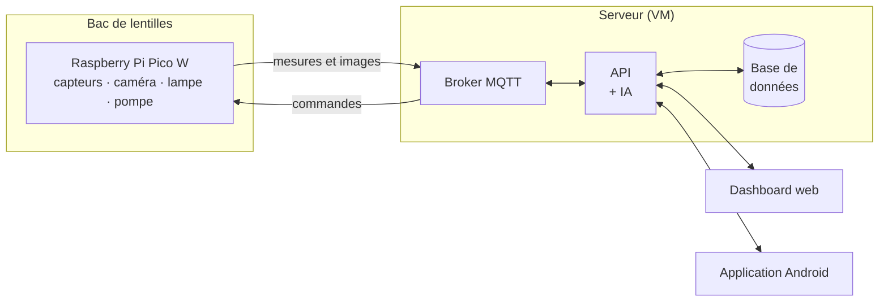

# lentIA

Suivi intelligent d'un bac de lentilles : des capteurs mesurent le bac en
continu, une IA estime les chances de pousse, et on surveille et pilote le
tout depuis un dashboard web ou une application Android.

*Projet scolaire.*

## Comment ça marche



1. Le **Pico** lit les capteurs et la caméra, et envoie tout au serveur par
   WiFi.
2. Le **serveur** enregistre les mesures, fait tourner l'IA et applique les
   règles d'automatisation (ex. « arroser si le sol est trop sec »).
3. Le **dashboard** et l'**app** affichent tout en temps réel et permettent
   d'allumer la lampe ou la pompe d'un clic.

## Les composants

| Composant | Dossier | Rôle |
|-----------|---------|------|
| **Firmware du Pico** | [`pico/`](pico/) | Lit les capteurs, filme le bac, pilote la lampe et la pompe |
| **Broker MQTT** | [`mosquitto/`](mosquitto/) | Messagerie entre le Pico et le serveur |
| **API** | [`api/`](api/) | Cœur du serveur : enregistre, calcule, automatise, sert les données |
| **Base de données** | [`postgres/`](postgres/) | Historique des mesures et des actions |
| **IA** | [`ia/`](ia/) | Réseau de neurones qui prédit les chances de pousse |
| **Dashboard web** | [`web/`](web/) | Interface dans le navigateur |
| **Application Android** | [`mobile/`](mobile/) | Même interface, sur téléphone |

## Le matériel

- **Capteurs** : température, humidité du sol, humidité de l'air, luminosité,
  niveau du réservoir d'eau
- **Caméra** : Arducam HM01B0 (noir et blanc), image en direct
- **Actionneurs** : lampe horticole et pompe d'arrosage (chauffage et
  ventilation prévus)

## Ce qu'on peut faire

- Voir l'état du bac **en direct** : mesures, caméra, capteurs hors ligne
- Consulter l'**historique** de chaque capteur sous forme de courbes
- **Piloter** la lampe et la pompe à la main (la pompe se coupe toute seule
  quand le réservoir est vide)
- Programmer des **automatisations** : plages horaires ou seuils
- Lire les **chances de survie** prédites par l'IA, avec des conseils
  (« monte l'humidité du sol à 68 % »)
- Retrouver chaque action dans le **journal**

L'accès est protégé par une connexion Google, réservée aux comptes
autorisés.

## Démarrer

Prérequis : [Docker](https://www.docker.com/).

```bash
cp .env.example .env    # renseigner le Client ID Google et les emails autorisés
docker compose up --build
```

Puis ouvrir **http://localhost**.

## Pour aller plus loin

- [**TECHNIQUE.md**](TECHNIQUE.md) : documentation technique complète
  (formats MQTT, routes de l'API, IA, authentification, app Android,
  déploiement)
- [**pico/README.md**](pico/README.md) : câblage du Pico, broche par broche
